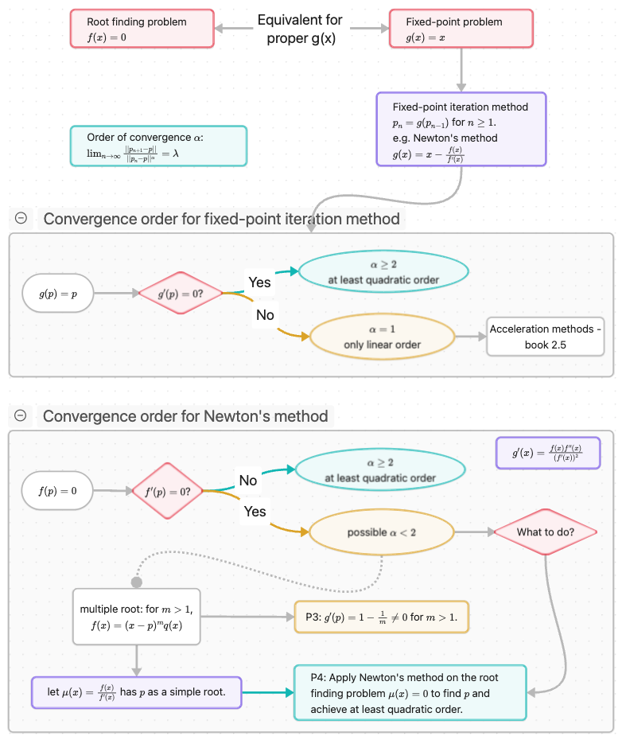

# Topic 01: Root Finding / Solution of Equations

> [!info]   Attribution
> - Created by Dr. Zheng Chen (UMass Dartmouth Math Department).

## Start here
- [Topic overview](./00-Topic-Overview.md)

## Sections
- [1.1 Bisection Method](./01-Bisection/00-Bisection-Overview.md)
- [1.2 Fixed-Point Iterations](./02-Fixed-Point/00-Fixed-Point-Overview.md)
- [1.3 Newton's Method](./03-Newton/00-Newton-Overview.md)
- [1.4 Alternatives to Newton's method](./04-Alternatives/00-Alternatives-Overview.md)
- [1.5 Error Analysis for Iterative Methods](./05-Error-Analysis/00-Error-Analysis-Overview.md)
- [1.6 Accelerating Convergence](./06-Accelerating-Convergence/00-Accelerating-Convergence-Overview.md)

## Topic map (concept map/flowchart)

*Figure: Topic 01 concept map (exported from Obsidian Canvas as a PNG).*
